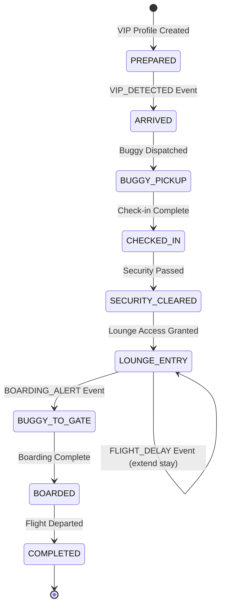
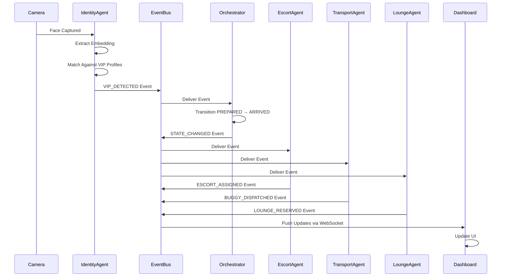

# Design Document: AURA-VIP Orchestration System

## Overview

AURA-VIP is an event-driven, multi-agent airport VIP orchestration system that autonomously manages the complete VIP journey from arrival through boarding. The system architecture consists of a Master Orchestrator coordinating six specialized agents through a central Event Bus, with real-time WebSocket communication to a React-based command dashboard.

The system uses face recognition (OpenCV + DeepFace) for VIP identification, rule-based decision making for service allocation, and state machine patterns for workflow management. All data is persisted in PostgreSQL/SQLite with comprehensive service logging for audit and recovery.

### Key Design Principles

1. **Event-Driven Architecture**: All inter-agent communication occurs through the Event Bus, ensuring loose coupling and scalability
2. **Agent Autonomy**: Each agent operates independently, subscribing to relevant events and making decisions within its domain
3. **State Machine Workflow**: VIP journey follows a strict state sequence enforced by the Master Orchestrator
4. **Real-Time Updates**: WebSocket communication ensures sub-second latency for dashboard updates
5. **Rule-Based Logic**: Business rules are centralized in a rule engine for maintainability
6. **Modular Design**: Each agent is a separate module, enabling independent development and testing

## Architecture

### System Components

```
┌─────────────────────────────────────────────────────────────────┐
│                        Frontend Layer                            │
│  ┌──────────────┐  ┌──────────────┐  ┌──────────────┐          │
│  │   Dashboard  │  │  VIP Details │  │   Escort     │          │
│  │     Page     │  │     Page     │  │  Management  │          │
│  └──────────────┘  └──────────────┘  └──────────────┘          │
│  ┌──────────────┐  ┌──────────────┐                            │
│  │   Transport  │  │    Lounge    │                            │
│  │     Panel    │  │     Panel    │                            │
│  └──────────────┘  └──────────────┘                            │
└─────────────────────────────────────────────────────────────────┘
                              │
                    WebSocket Connection
                              │
┌─────────────────────────────────────────────────────────────────┐
│                        Backend Layer                             │
│                                                                  │
│  ┌────────────────────────────────────────────────────────┐    │
│  │              Master Orchestrator                        │    │
│  │  - State Machine Management                             │    │
│  │  - Workflow Lifecycle Control                           │    │
│  │  - Event Coordination                                   │    │
│  └────────────────────────────────────────────────────────┘    │
│                              │                                   │
│  ┌────────────────────────────────────────────────────────┐    │
│  │                    Event Bus                            │    │
│  │  - Event Subscription Registry                          │    │
│  │  - Event Publishing & Delivery                          │    │
│  │  - Event Logging                                        │    │
│  └────────────────────────────────────────────────────────┘    │
│                              │                                   │
│  ┌──────────┬──────────┬──────────┬──────────┬──────────┐      │
│  │ Identity │  Escort  │Transport │  Lounge  │  Flight  │      │
│  │  Agent   │  Agent   │  Agent   │  Agent   │Intel Agent│     │
│  └──────────┴──────────┴──────────┴──────────┴──────────┘      │
│  ┌──────────┐                                                   │
│  │ Baggage  │                                                   │
│  │  Agent   │                                                   │
│  └──────────┘                                                   │
│                              │                                   │
│  ┌────────────────────────────────────────────────────────┐    │
│  │              Rule Engine                                │    │
│  │  - VIP Service Rules                                    │    │
│  │  - Resource Allocation Rules                            │    │
│  │  - Timing Rules                                         │    │
│  └────────────────────────────────────────────────────────┘    │
│                              │                                   │
│  ┌────────────────────────────────────────────────────────┐    │
│  │              Database Layer                             │    │
│  │  - VIP Profiles                                         │    │
│  │  - Resource Assignments                                 │    │
│  │  - Service Logs                                         │    │
│  │  - Flight Information                                   │    │
│  └────────────────────────────────────────────────────────┘    │
└─────────────────────────────────────────────────────────────────┘
```

### State Machine Diagram



### Event Flow Diagram



## Components and Interfaces

### 1. Master Orchestrator

**Responsibilities:**
- Manage VIP workflow state machine
- Enforce state transition rules
- Coordinate agent activities through event emission
- Handle workflow recovery on system restart

**Key Methods:**
```python
class MasterOrchestrator:
    async def handle_vip_detected(self, vip_id: str, confidence: float) -> None:
        """Transition VIP from PREPARED to ARRIVED state"""
        
    async def transition_state(self, vip_id: str, new_state: VIPState) -> bool:
        """Validate and execute state transition"""
        
    async def handle_flight_delay(self, flight_id: str, new_departure: datetime) -> None:
        """Adjust workflow timing for flight delays"""
        
    async def recover_workflows(self) -> None:
        """Restore active workflows from database on startup"""
```

**State Transition Rules:**
- Only allow transitions in the defined sequence
- Reject backward transitions (except for error recovery)
- Emit STATE_CHANGED event after successful transition
- Log all transition attempts with timestamp and result

### 2. Event Bus

**Responsibilities:**
- Maintain event subscription registry
- Deliver events to subscribed agents
- Log all events for audit trail
- Handle event delivery failures with retry logic

**Key Methods:**
```python
class EventBus:
    def subscribe(self, event_type: EventType, handler: Callable) -> None:
        """Register agent handler for specific event type"""
        
    async def publish(self, event: Event) -> None:
        """Deliver event to all subscribed handlers"""
        
    async def publish_with_retry(self, event: Event, max_retries: int = 3) -> None:
        """Publish event with retry logic for failed deliveries"""
        
    def get_event_history(self, vip_id: str) -> List[Event]:
        """Retrieve event history for specific VIP"""
```

**Event Types:**
```python
class EventType(Enum):
    VIP_DETECTED = "vip_detected"
    STATE_CHANGED = "state_changed"
    ESCORT_ASSIGNED = "escort_assigned"
    BUGGY_DISPATCHED = "buggy_dispatched"
    LOUNGE_RESERVED = "lounge_reserved"
    LOUNGE_ENTRY = "lounge_entry"
    FLIGHT_DELAY = "flight_delay"
    BOARDING_ALERT = "boarding_alert"
    BAGGAGE_PRIORITY_TAGGED = "baggage_priority_tagged"
```

### 3. Identity Agent

**Responsibilities:**
- Capture faces from camera feed using OpenCV
- Extract face embeddings using DeepFace
- Match embeddings against stored VIP profiles
- Emit VIP_DETECTED event when confidence exceeds threshold

**Key Methods:**
```python
class IdentityAgent:
    async def capture_face(self) -> np.ndarray:
        """Capture face image from camera"""
        
    async def extract_embedding(self, face_image: np.ndarray) -> np.ndarray:
        """Extract face embedding using DeepFace"""
        
    async def match_vip(self, embedding: np.ndarray) -> Tuple[Optional[str], float]:
        """Match embedding against VIP profiles, return (vip_id, confidence)"""
        
    async def process_camera_feed(self) -> None:
        """Continuous camera monitoring loop"""
```

**Face Recognition Configuration:**
- Model: DeepFace with VGG-Face backend
- Confidence threshold: 0.85 (configurable)
- Matching algorithm: Cosine similarity
- Camera resolution: 640x480 minimum
- Frame processing rate: 2 FPS (to reduce CPU load)

### 4. Escort Agent

**Responsibilities:**
- Maintain escort availability pool
- Assign escorts to VIPs based on availability
- Track escort assignments and workload
- Release escorts when VIP journey completes

**Key Methods:**
```python
class EscortAgent:
    async def handle_vip_arrived(self, vip_id: str) -> None:
        """Assign escort when VIP arrives"""
        
    async def find_available_escort(self) -> Optional[str]:
        """Find first available escort from pool"""
        
    async def assign_escort(self, escort_id: str, vip_id: str) -> None:
        """Create escort assignment and update status"""
        
    async def release_escort(self, escort_id: str) -> None:
        """Mark escort as available after VIP completion"""
```

**Escort Assignment Rules:**
- Always assign escort to VIP (per business rule)
- If no escorts available, queue request
- Process queue in FIFO order
- Track assignment history for reporting

### 5. Transport Agent

**Responsibilities:**
- Manage buggy fleet availability
- Allocate buggies to VIPs
- Simulate buggy dispatch and battery depletion
- Track buggy locations and status

**Key Methods:**
```python
class TransportAgent:
    async def handle_vip_arrived(self, vip_id: str) -> None:
        """Allocate buggy when VIP arrives"""
        
    async def find_available_buggy(self) -> Optional[str]:
        """Find buggy with battery > 20%"""
        
    async def dispatch_buggy(self, buggy_id: str, vip_id: str, destination: str) -> None:
        """Dispatch buggy to pickup/destination"""
        
    async def simulate_trip(self, buggy_id: str, duration_minutes: int) -> None:
        """Simulate buggy trip with battery depletion"""
        
    async def release_buggy(self, buggy_id: str) -> None:
        """Mark buggy as available after trip"""
```

**Buggy Management Rules:**
- Always assign buggy to VIP (per business rule)
- Only assign buggies with battery > 20%
- Deplete battery by 5% per trip
- Simulate trip duration: arrival→lounge (5 min), lounge→gate (7 min)
- Track buggy location: idle, en_route_pickup, en_route_destination

### 6. Lounge Agent

**Responsibilities:**
- Create lounge reservations for VIPs
- Verify face recognition at lounge entry
- Track lounge occupancy and capacity
- Manage reservation extensions for flight delays

**Key Methods:**
```python
class LoungeAgent:
    async def handle_vip_arrived(self, vip_id: str) -> None:
        """Create lounge reservation"""
        
    async def verify_lounge_entry(self, face_embedding: np.ndarray) -> Optional[str]:
        """Verify VIP at lounge entry via face recognition"""
        
    async def grant_access(self, vip_id: str) -> None:
        """Grant lounge access and update occupancy"""
        
    async def extend_reservation(self, vip_id: str, additional_minutes: int) -> None:
        """Extend reservation due to flight delay"""
        
    async def release_reservation(self, vip_id: str) -> None:
        """Release reservation when VIP departs"""
```

**Lounge Management Rules:**
- Pre-reserve lounge for all VIPs (per business rule)
- Maximum capacity: 50 VIPs (configurable)
- Queue reservations when at capacity
- Verify identity at entry using face recognition
- Default reservation duration: 90 minutes

### 7. Flight Intelligence Agent

**Responsibilities:**
- Monitor flight departure times
- Detect flight delays and status changes
- Emit boarding alerts 15 minutes before boarding
- Coordinate with orchestrator for workflow adjustments

**Key Methods:**
```python
class FlightIntelligenceAgent:
    async def monitor_flights(self) -> None:
        """Continuous flight monitoring loop"""
        
    async def check_boarding_time(self, flight_id: str) -> None:
        """Check if boarding alert should be triggered"""
        
    async def detect_delay(self, flight_id: str) -> Optional[datetime]:
        """Detect flight delay and return new departure time"""
        
    async def emit_boarding_alert(self, flight_id: str, vip_ids: List[str]) -> None:
        """Emit boarding alert for all VIPs on flight"""
```

**Flight Monitoring Rules:**
- Check flight status every 60 seconds
- Emit BOARDING_ALERT 15 minutes before boarding time
- Emit FLIGHT_DELAY event when delay detected
- Boarding time = departure time - 30 minutes

### 8. Baggage Agent

**Responsibilities:**
- Generate priority baggage tags for VIPs
- Simulate priority baggage routing
- Track baggage loading status
- Adjust priority for flight delays

**Key Methods:**
```python
class BaggageAgent:
    async def handle_vip_checked_in(self, vip_id: str) -> None:
        """Generate priority baggage tag"""
        
    async def simulate_baggage_routing(self, vip_id: str, flight_id: str) -> None:
        """Simulate priority baggage handling"""
        
    async def track_loading_status(self, vip_id: str) -> str:
        """Get current baggage loading status"""
```

### 9. Rule Engine

**Responsibilities:**
- Centralize business rule definitions
- Evaluate rules for decision making
- Provide rule explanations for audit

**Key Rules:**
```python
class RuleEngine:
    def vip_gets_escort(self) -> bool:
        """VIP always gets escort by default"""
        return True
        
    def vip_gets_buggy(self) -> bool:
        """VIP always gets buggy by default"""
        return True
        
    def lounge_pre_reserved(self) -> bool:
        """Lounge is pre-reserved for all VIPs"""
        return True
        
    def boarding_alert_minutes(self) -> int:
        """Boarding alert triggers N minutes before boarding"""
        return 15
        
    def should_extend_lounge(self, delay_minutes: int) -> bool:
        """Flight delay extends lounge time"""
        return delay_minutes > 10
```

### 10. WebSocket Manager

**Responsibilities:**
- Manage WebSocket connections from frontend clients
- Push real-time updates to connected clients
- Handle connection lifecycle (connect, disconnect, reconnect)
- Broadcast events to all connected clients

**Key Methods:**
```python
class WebSocketManager:
    async def connect(self, websocket: WebSocket) -> None:
        """Accept new WebSocket connection"""
        
    async def disconnect(self, websocket: WebSocket) -> None:
        """Handle client disconnection"""
        
    async def broadcast(self, message: dict) -> None:
        """Send message to all connected clients"""
        
    async def send_to_client(self, websocket: WebSocket, message: dict) -> None:
        """Send message to specific client"""
```

**WebSocket Message Format:**
```python
{
    "type": "vip_update" | "escort_update" | "buggy_update" | "lounge_update" | "flight_update",
    "payload": {
        "id": "resource_id",
        "data": {...}
    },
    "timestamp": "ISO8601 timestamp"
}
```

## Data Models

### VIP Profile
```python
class VIPProfile(BaseModel):
    id: str  # UUID
    name: str
    face_embedding: List[float]  # 128-dimensional vector from DeepFace
    flight_id: str
    current_state: VIPState
    created_at: datetime
    updated_at: datetime
```

### Escort
```python
class Escort(BaseModel):
    id: str  # UUID
    name: str
    status: EscortStatus  # available, assigned, off_duty
    assigned_vip_id: Optional[str]
    assignment_history: List[Assignment]
    created_at: datetime
```

### Buggy
```python
class Buggy(BaseModel):
    id: str  # UUID
    battery_level: int  # 0-100
    status: BuggyStatus  # available, assigned, charging, maintenance
    assigned_vip_id: Optional[str]
    current_location: str  # idle, en_route_pickup, en_route_destination
    created_at: datetime
```

### Flight
```python
class Flight(BaseModel):
    id: str  # Flight number
    departure_time: datetime
    boarding_time: datetime
    status: FlightStatus  # scheduled, boarding, departed, delayed, cancelled
    gate: str
    destination: str
    delay_minutes: int
    created_at: datetime
```

### Service Log
```python
class ServiceLog(BaseModel):
    id: str  # UUID
    vip_id: str
    event_type: EventType
    event_data: dict
    timestamp: datetime
    agent_source: str
```

### Lounge Reservation
```python
class LoungeReservation(BaseModel):
    id: str  # UUID
    vip_id: str
    reservation_time: datetime
    entry_time: Optional[datetime]
    exit_time: Optional[datetime]
    duration_minutes: int
    status: ReservationStatus  # reserved, active, completed, cancelled
```

### Event
```python
class Event(BaseModel):
    id: str  # UUID
    event_type: EventType
    payload: dict
    source_agent: str
    timestamp: datetime
    vip_id: Optional[str]
```

### Enums
```python
class VIPState(Enum):
    PREPARED = "prepared"
    ARRIVED = "arrived"
    BUGGY_PICKUP = "buggy_pickup"
    CHECKED_IN = "checked_in"
    SECURITY_CLEARED = "security_cleared"
    LOUNGE_ENTRY = "lounge_entry"
    BUGGY_TO_GATE = "buggy_to_gate"
    BOARDED = "boarded"
    COMPLETED = "completed"

class EscortStatus(Enum):
    AVAILABLE = "available"
    ASSIGNED = "assigned"
    OFF_DUTY = "off_duty"

class BuggyStatus(Enum):
    AVAILABLE = "available"
    ASSIGNED = "assigned"
    CHARGING = "charging"
    MAINTENANCE = "maintenance"

class FlightStatus(Enum):
    SCHEDULED = "scheduled"
    BOARDING = "boarding"
    DEPARTED = "departed"
    DELAYED = "delayed"
    CANCELLED = "cancelled"

class ReservationStatus(Enum):
    RESERVED = "reserved"
    ACTIVE = "active"
    COMPLETED = "completed"
    CANCELLED = "cancelled"
```

## Database Schema

### Tables

**vip_profiles**
- id (UUID, PRIMARY KEY)
- name (VARCHAR)
- face_embedding (BYTEA)  # Serialized numpy array
- flight_id (VARCHAR, FOREIGN KEY)
- current_state (VARCHAR)
- created_at (TIMESTAMP)
- updated_at (TIMESTAMP)

**escorts**
- id (UUID, PRIMARY KEY)
- name (VARCHAR)
- status (VARCHAR)
- assigned_vip_id (UUID, FOREIGN KEY, NULLABLE)
- created_at (TIMESTAMP)

**buggies**
- id (UUID, PRIMARY KEY)
- battery_level (INTEGER)
- status (VARCHAR)
- assigned_vip_id (UUID, FOREIGN KEY, NULLABLE)
- current_location (VARCHAR)
- created_at (TIMESTAMP)

**flights**
- id (VARCHAR, PRIMARY KEY)  # Flight number
- departure_time (TIMESTAMP)
- boarding_time (TIMESTAMP)
- status (VARCHAR)
- gate (VARCHAR)
- destination (VARCHAR)
- delay_minutes (INTEGER)
- created_at (TIMESTAMP)

**service_logs**
- id (UUID, PRIMARY KEY)
- vip_id (UUID, FOREIGN KEY)
- event_type (VARCHAR)
- event_data (JSONB)
- timestamp (TIMESTAMP)
- agent_source (VARCHAR)

**lounge_reservations**
- id (UUID, PRIMARY KEY)
- vip_id (UUID, FOREIGN KEY)
- reservation_time (TIMESTAMP)
- entry_time (TIMESTAMP, NULLABLE)
- exit_time (TIMESTAMP, NULLABLE)
- duration_minutes (INTEGER)
- status (VARCHAR)

### Indexes
- vip_profiles: index on flight_id, current_state
- escorts: index on status, assigned_vip_id
- buggies: index on status, assigned_vip_id
- service_logs: index on vip_id, event_type, timestamp
- lounge_reservations: index on vip_id, status


## Correctness Properties

A property is a characteristic or behavior that should hold true across all valid executions of a system—essentially, a formal statement about what the system should do. Properties serve as the bridge between human-readable specifications and machine-verifiable correctness guarantees.

### Property 1: Face Recognition Workflow Completeness

*For any* captured face image, the Identity_Agent should extract a face embedding, compare it against all stored VIP profiles, and emit a VIP_DETECTED event if and only if the confidence score exceeds the threshold.

**Validates: Requirements 1.1, 1.2, 1.3**

### Property 2: Face Recognition Rejection

*For any* face recognition attempt where confidence is below the threshold, the Identity_Agent should log the attempt without emitting a VIP_DETECTED event or triggering VIP services.

**Validates: Requirements 1.5**

### Property 3: Event Bus Broadcast Completeness

*For any* event emitted to the Event_Bus, all agents subscribed to that event type should receive the event exactly once.

**Validates: Requirements 1.4, 13.2**

### Property 4: State Transition Sequence Enforcement

*For any* VIP workflow, state transitions should only occur in the valid sequence: PREPARED → ARRIVED → BUGGY_PICKUP → CHECKED_IN → SECURITY_CLEARED → LOUNGE_ENTRY → BUGGY_TO_GATE → BOARDED → COMPLETED, and any attempt to transition out of sequence should be rejected.

**Validates: Requirements 2.3, 2.4**

### Property 5: State Transition Event Emission

*For any* successful state transition, the Master_Orchestrator should emit a STATE_CHANGED event containing the VIP ID, previous state, and new state.

**Validates: Requirements 2.2**

### Property 6: VIP Detection Triggers Arrival

*For any* VIP in PREPARED state, receiving a VIP_DETECTED event should transition the VIP to ARRIVED state.

**Validates: Requirements 2.1**

### Property 7: Workflow Completion Resource Release

*For any* VIP that reaches COMPLETED state, all assigned resources (escort, buggy, lounge reservation) should be released and marked as available.

**Validates: Requirements 2.5, 3.5, 4.5**

### Property 8: Escort Assignment Workflow

*For any* VIP_DETECTED event, the Escort_Agent should identify an available escort, assign it to the VIP, update the escort status to assigned, and emit an ESCORT_ASSIGNED event.

**Validates: Requirements 3.1, 3.2, 3.4**

### Property 9: Escort Queue Management

*For any* escort assignment request when no escorts are available, the request should be queued and processed in FIFO order when an escort becomes available.

**Validates: Requirements 3.3**

### Property 10: Buggy Assignment with Battery Constraint

*For any* VIP transitioning to ARRIVED state, the Transport_Agent should assign a buggy with battery level above 20%, update the buggy status to assigned, and emit a BUGGY_DISPATCHED event.

**Validates: Requirements 4.1, 4.2**

### Property 11: Buggy Dispatch on Security Clearance

*For any* VIP transitioning to SECURITY_CLEARED state, the Transport_Agent should dispatch the assigned buggy to transport the VIP to the lounge.

**Validates: Requirements 4.3**

### Property 12: Buggy Dispatch on Boarding Alert

*For any* BOARDING_ALERT event, the Transport_Agent should dispatch the assigned buggy to transport the VIP from lounge to gate.

**Validates: Requirements 4.4**

### Property 13: Battery Depletion Simulation

*For any* buggy trip, the battery level should decrease by 5% and the buggy should be marked unavailable for new assignments if battery falls below 20%.

**Validates: Requirements 11.2, 11.3**

### Property 14: Buggy Status Update After Trip

*For any* buggy that completes a trip, the status should be updated to available if battery level is above 20%.

**Validates: Requirements 11.5**

### Property 15: Lounge Reservation Creation

*For any* VIP_DETECTED event, the Lounge_Agent should create a lounge reservation for the VIP.

**Validates: Requirements 5.1**

### Property 16: Lounge Capacity Queueing

*For any* lounge reservation request when occupancy equals capacity, the reservation should be queued and the VIP should be notified of wait time.

**Validates: Requirements 5.2**

### Property 17: Lounge Access Verification Workflow

*For any* face detected at lounge entry, the Lounge_Agent should verify the face against VIP profiles with active reservations, and grant access with a LOUNGE_ENTRY event if verification succeeds.

**Validates: Requirements 5.3, 5.4**

### Property 18: Lounge Occupancy Tracking

*For any* LOUNGE_ENTRY event, the occupancy count should increment, and for any VIP departure, the occupancy count should decrement and the reservation should be released.

**Validates: Requirements 5.5, 12.3, 12.4**

### Property 19: Boarding Alert Timing

*For any* flight, the Flight_Intelligence_Agent should emit a BOARDING_ALERT event exactly 15 minutes before boarding time.

**Validates: Requirements 6.2, 14.4**

### Property 20: Flight Delay Event Emission

*For any* detected flight delay, the Flight_Intelligence_Agent should emit a FLIGHT_DELAY event containing the flight ID and new departure time.

**Validates: Requirements 6.3**

### Property 21: Flight Delay Workflow Adjustment

*For any* FLIGHT_DELAY event, the Master_Orchestrator should extend lounge reservation time and the Transport_Agent should reschedule buggy dispatch.

**Validates: Requirements 6.4, 14.5**

### Property 22: Flight Boarding Status Transition

*For any* flight status change to boarding, the Flight_Intelligence_Agent should notify the Master_Orchestrator to transition VIPs to BUGGY_TO_GATE state.

**Validates: Requirements 6.5**

### Property 23: Priority Baggage Tag Generation

*For any* VIP transitioning to CHECKED_IN state, the Baggage_Agent should generate a priority baggage tag and emit a BAGGAGE_PRIORITY_TAGGED event.

**Validates: Requirements 7.1, 7.2**

### Property 24: Baggage Completion Logging

*For any* baggage that reaches the aircraft, the Baggage_Agent should log the completion time.

**Validates: Requirements 7.4**

### Property 25: Baggage Priority Adjustment on Delay

*For any* VIP flight delay, the Baggage_Agent should adjust the baggage loading priority accordingly.

**Validates: Requirements 7.5**

### Property 26: WebSocket Update Latency

*For any* system event, the AURA_System should push updates to all connected WebSocket clients within 500ms.

**Validates: Requirements 8.2**

### Property 27: Dashboard Data Completeness

*For any* dashboard view, all required data fields (escort availability, buggy fleet status, lounge occupancy, VIP states, assignments) should be present and accurate.

**Validates: Requirements 8.4, 9.3, 9.4**

### Property 28: Service Log Chronological Ordering

*For any* VIP, all Service_Log entries should be displayed in chronological order by timestamp.

**Validates: Requirements 9.2**

### Property 29: Real-Time Timeline Updates

*For any* new event for a VIP, the event should be appended to the VIP's timeline in the dashboard in real-time without manual refresh.

**Validates: Requirements 9.5**

### Property 30: Escort Filtering Correctness

*For any* escort status filter applied, all displayed escorts should match the filter criteria (available, assigned, or off-duty).

**Validates: Requirements 10.2**

### Property 31: Real-Time Status Updates

*For any* resource status change (escort, buggy, lounge), the dashboard should update the display in real-time via WebSocket.

**Validates: Requirements 10.3, 11.5**

### Property 32: Lounge Occupancy Indicator

*For any* lounge state where occupancy exceeds 80% of capacity, a visual indicator should be displayed on the dashboard.

**Validates: Requirements 12.5**

### Property 33: Event Subscription Registration

*For any* agent initialization, the agent should be registered with the Event_Bus for all relevant event types it handles.

**Validates: Requirements 13.1, 18.2**

### Property 34: Event Type Support

*For any* of the defined event types (VIP_DETECTED, ESCORT_ASSIGNED, BUGGY_DISPATCHED, LOUNGE_ENTRY, FLIGHT_DELAY, BOARDING_ALERT, BAGGAGE_PRIORITY_TAGGED), the Event_Bus should accept and deliver the event.

**Validates: Requirements 13.3**

### Property 35: Event Logging Completeness

*For any* event emitted through the Event_Bus, a log entry should be created containing timestamp, source agent, event type, and event payload.

**Validates: Requirements 13.4**

### Property 36: Event Delivery Retry Logic

*For any* event delivery failure, the Event_Bus should retry delivery up to 3 times before logging a permanent failure.

**Validates: Requirements 13.5**

### Property 37: Default Resource Assignment Rules

*For any* VIP detected, the system should automatically assign an escort, assign a buggy, and create a lounge reservation by default.

**Validates: Requirements 14.1, 14.2, 14.3**

### Property 38: Database Persistence Completeness

*For any* VIP detection, resource assignment, or system event, a corresponding database 